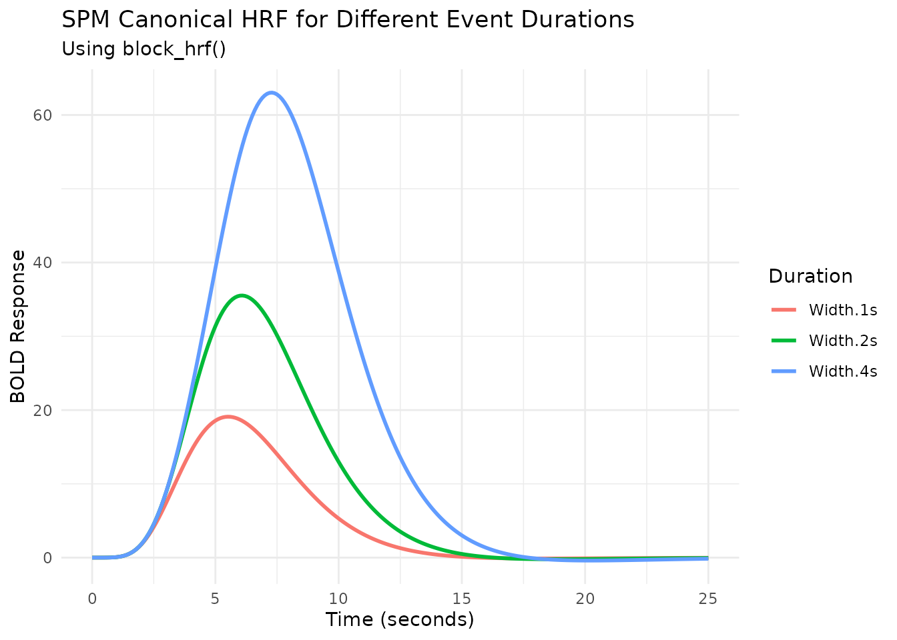
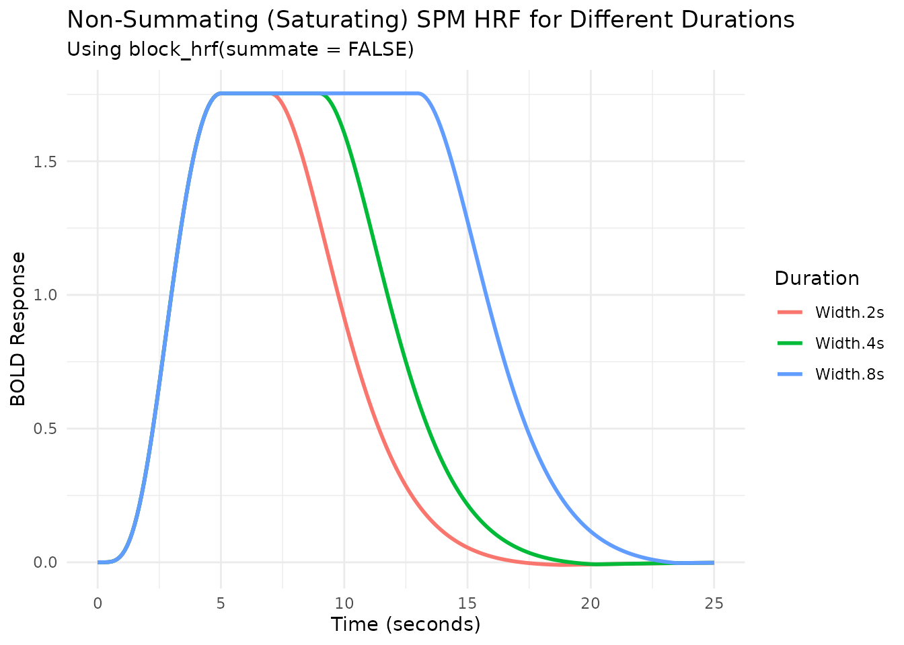
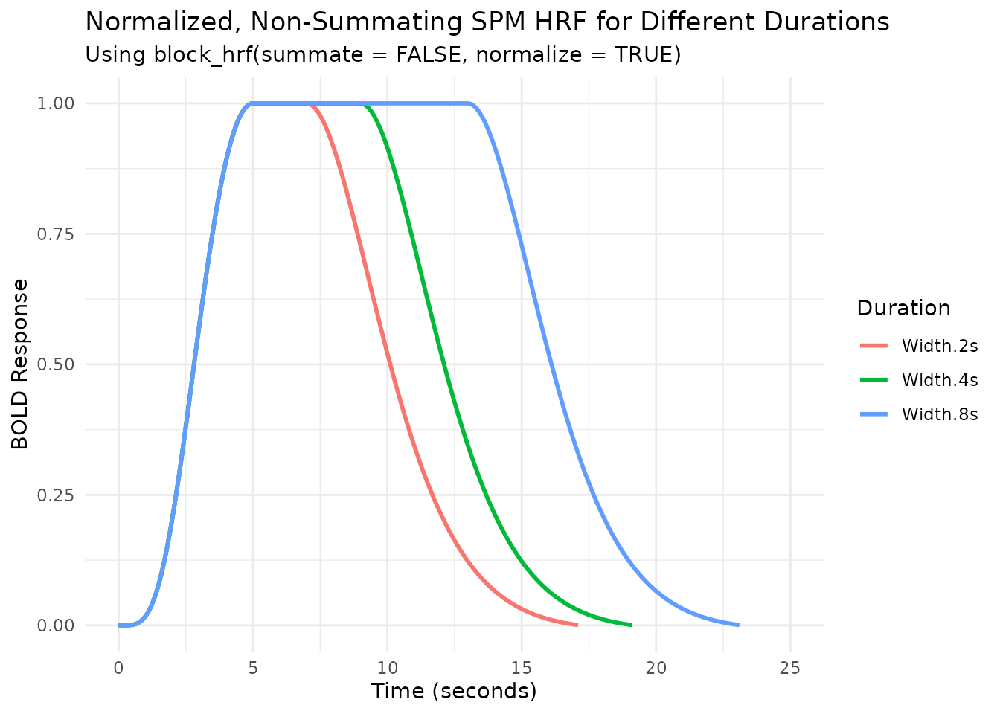
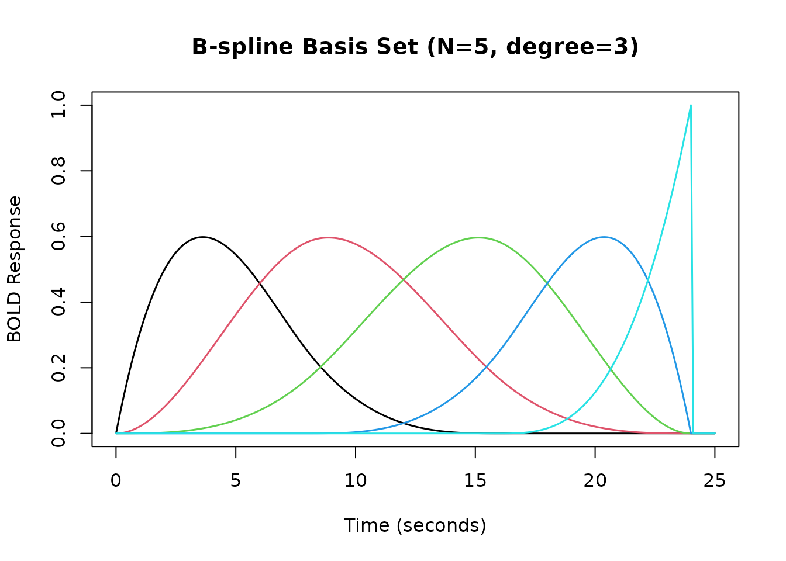
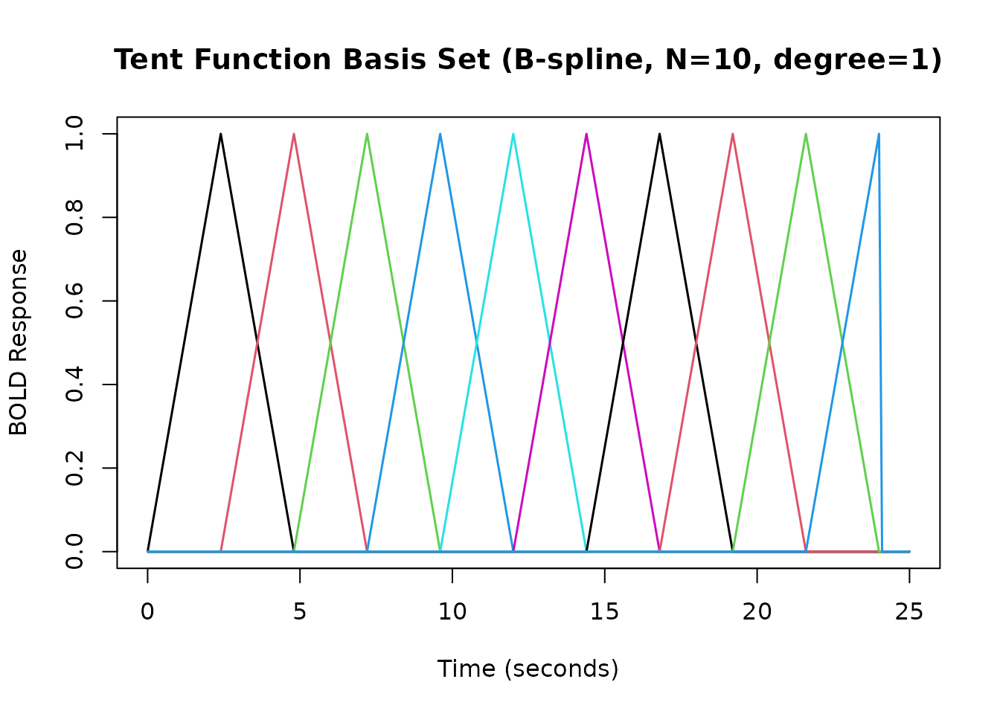
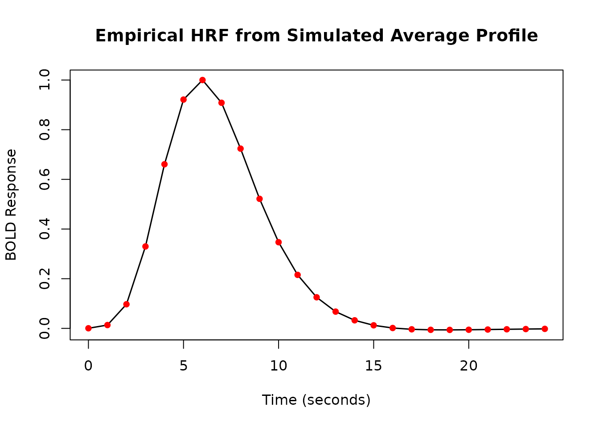
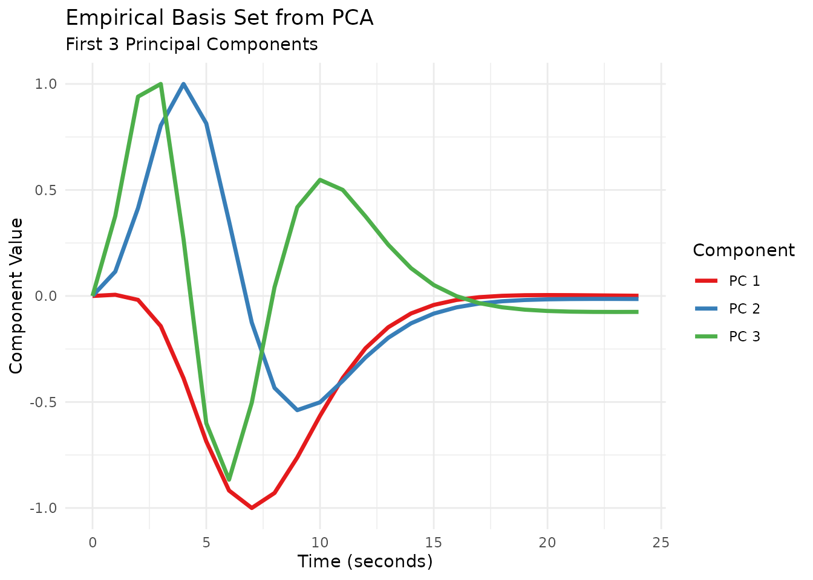

# Hemodynamic Response Functions

## Introduction to Hemodynamic Response Functions (HRFs)

A hemodynamic response function (HRF) models the temporal evolution of
the fMRI BOLD (Blood-Oxygen-Level-Dependent) signal in response to a
brief neural event. Typically, the BOLD signal peaks 4-6 seconds after
the event onset and then returns to baseline, often with a slight
undershoot.

`fmrihrf` provides tools to define, manipulate, and visualize various
HRFs commonly used in fMRI analysis.

## Pre-defined HRF Objects

`fmrihrf` includes several pre-defined HRF objects, which are
essentially functions with specific attributes defining their type,
number of basis functions (`nbasis`), and effective duration (`span`).

Let’s look at two common examples: the SPM canonical HRF (`HRF_SPMG1`)
and a Gaussian HRF (`HRF_GAUSSIAN`).

``` r
# SPM canonical HRF (based on difference of two gamma functions)
print(HRF_SPMG1)
#> function (t) 
#> {
#>     do.call(orig_f, c(list(t = t), params))
#> }
#> <bytecode: 0x5644e15d4718>
#> <environment: 0x5644e15d2e88>
#> attr(,"class")
#> [1] "HRF"      "function"
#> attr(,"name")
#> [1] "SPMG1"
#> attr(,"nbasis")
#> [1] 1
#> attr(,"span")
#> [1] 24
#> attr(,"param_names")
#> [1] "P1" "P2" "A1"
#> attr(,"params")
#> attr(,"params")$P1
#> [1] 5
#> 
#> attr(,"params")$P2
#> [1] 15
#> 
#> attr(,"params")$A1
#> [1] 0.0833

# Gaussian HRF
print(HRF_GAUSSIAN)
#> function (t) 
#> {
#>     do.call(orig_f, c(list(t = t), params))
#> }
#> <bytecode: 0x5644e1656998>
#> <environment: 0x5644e1651e00>
#> attr(,"class")
#> [1] "HRF"      "function"
#> attr(,"name")
#> [1] "gaussian"
#> attr(,"nbasis")
#> [1] 1
#> attr(,"span")
#> [1] 24
#> attr(,"param_names")
#> [1] "mean" "sd"  
#> attr(,"params")
#> attr(,"params")$mean
#> [1] 6
#> 
#> attr(,"params")$sd
#> [1] 2
```

These objects are functions themselves, so you can evaluate them at
specific time points:

``` r
time_points <- seq(0, 25, by = 0.1)

# Evaluate the HRFs
y_spm <- HRF_SPMG1(time_points)
y_gauss <- HRF_GAUSSIAN(time_points)

# Manually scale each to peak at 1.0 for easier shape comparison
y_spm_scaled <- y_spm / max(y_spm)
y_gauss_scaled <- y_gauss / max(y_gauss)

# Combine into a data frame for plotting
plot_df <- data.frame(
  Time = time_points,
  SPM_Canonical = y_spm_scaled,
  Gaussian = y_gauss_scaled
) %>% 
  pivot_longer(-Time, names_to = "HRF_Type", values_to = "Response")

# Plot using ggplot2
ggplot(plot_df, aes(x = Time, y = Response, color = HRF_Type)) +
  geom_line(linewidth = 1) +
  labs(title = "Comparison of SPM Canonical and Gaussian HRFs",
       subtitle = "HRFs manually scaled to peak at 1.0 for comparison",
       x = "Time (seconds)",
       y = "BOLD Response (normalized)",
       color = "HRF Type") +
  theme_minimal()
```


Note that the `span` attribute (e.g., 24 seconds) indicates the
approximate time window over which the HRF is non-zero.

## Modifying HRF Parameters with `gen_hrf`

The `gen_hrf` function is a flexible way to create new HRF functions,
often by modifying the parameters of existing ones.

For example, the `hrf_gaussian` function takes `mean` and `sd`
arguments. We can use `gen_hrf` to create Gaussian HRFs with different
peak times (`mean`) and widths (`sd`).

``` r
# Create Gaussian HRFs with different parameters using gen_hrf
# Note: hrf_gaussian is the underlying function, not the HRF object HRF_GAUSSIAN
hrf_gauss_7_3 <- gen_hrf(hrf_gaussian, mean = 7, sd = 3, name = "Gaussian (Mean=7, SD=3)")
hrf_gauss_5_2 <- gen_hrf(hrf_gaussian, mean = 5, sd = 2, name = "Gaussian (Mean=5, SD=2)")
hrf_gauss_4_1 <- gen_hrf(hrf_gaussian, mean = 4, sd = 1, name = "Gaussian (Mean=4, SD=1)")

# Evaluate the new HRFs
vals1 <- hrf_gauss_7_3(time_points)
vals2 <- hrf_gauss_5_2(time_points)
vals3 <- hrf_gauss_4_1(time_points)

# Combine for plotting
plot_df_params <- data.frame(
  Time = time_points,
  `Mean=7, SD=3` = vals1,
  `Mean=5, SD=2` = vals2,
  `Mean=4, SD=1` = vals3
) %>%
  pivot_longer(-Time, names_to = "Parameters", values_to = "Response")

# Plot
ggplot(plot_df_params, aes(x = Time, y = Response, color = Parameters)) +
  geom_line(linewidth = 1) +
  labs(title = "Gaussian HRFs with Different Parameters",
       x = "Time (seconds)",
       y = "BOLD Response",
       color = "Parameters") +
  theme_minimal()
```


`gen_hrf` can also directly incorporate lags and durations (see later
sections).

## Modeling Event Duration with `block_hrf`

fMRI events often have a duration (e.g., a stimulus presented for
several seconds). The `block_hrf` function (or `gen_hrf` with a `width`
argument) modifies an HRF to model the response to a sustained event of
a specific `width` (duration). Internally, it convolves the original HRF
with a boxcar function of the specified width.

The `precision` argument controls the sampling resolution used for this
convolution.

``` r
# Create blocked HRFs using the SPM canonical HRF with different durations
hrf_spm_w1 <- block_hrf(HRF_SPMG1, width = 1)
hrf_spm_w2 <- block_hrf(HRF_SPMG1, width = 2)
hrf_spm_w4 <- block_hrf(HRF_SPMG1, width = 4)

# Evaluate
resp_w1 <- hrf_spm_w1(time_points)
resp_w2 <- hrf_spm_w2(time_points)
resp_w4 <- hrf_spm_w4(time_points)

# Combine for plotting
plot_df_blocked <- data.frame(
  Time = time_points,
  `Width=1s` = resp_w1,
  `Width=2s` = resp_w2,
  `Width=4s` = resp_w4
) %>%
  pivot_longer(-Time, names_to = "Duration", values_to = "Response")

# Plot
ggplot(plot_df_blocked, aes(x = Time, y = Response, color = Duration)) +
  geom_line(linewidth = 1) +
  labs(title = "SPM Canonical HRF for Different Event Durations",
       subtitle = "Using block_hrf()",
       x = "Time (seconds)",
       y = "BOLD Response",
       color = "Duration") +
  theme_minimal()
```



### Normalization

By default, longer durations lead to higher peak responses (assuming
summation, see next section). Setting `normalize=TRUE` in `block_hrf`
(or `gen_hrf`) rescales the response so the peak amplitude is
approximately 1, regardless of duration.

``` r
# Create normalized blocked HRFs
hrf_spm_w1_norm <- block_hrf(HRF_SPMG1, width = 1, normalize = TRUE)
hrf_spm_w2_norm <- block_hrf(HRF_SPMG1, width = 2, normalize = TRUE)
hrf_spm_w4_norm <- block_hrf(HRF_SPMG1, width = 4, normalize = TRUE)

# Evaluate
resp_w1_norm <- hrf_spm_w1_norm(time_points)
resp_w2_norm <- hrf_spm_w2_norm(time_points)
resp_w4_norm <- hrf_spm_w4_norm(time_points)

# Combine for plotting
plot_df_blocked_norm <- data.frame(
  Time = time_points,
  `Width=1s` = resp_w1_norm,
  `Width=2s` = resp_w2_norm,
  `Width=4s` = resp_w4_norm
) %>%
  pivot_longer(-Time, names_to = "Duration", values_to = "Response")

# Plot
ggplot(plot_df_blocked_norm, aes(x = Time, y = Response, color = Duration)) +
  geom_line(linewidth = 1) +
  labs(title = "Normalized SPM Canonical HRF for Different Durations",
       subtitle = "Using block_hrf(normalize = TRUE)",
       x = "Time (seconds)",
       y = "BOLD Response",
       color = "Duration") +
  theme_minimal() +
  ylim(0, NA) # Ensure y-axis starts at 0
```


### Modeling Saturation with `summate`

The `summate` argument in `block_hrf` controls whether the response
accumulates over the duration (`summate=TRUE`, default) or saturates
(`summate=FALSE`). Saturation implies that the response reaches a
plateau and doesn’t increase further with longer stimulation.

``` r
# Create non-summating blocked HRFs
hrf_spm_w2_nosum <- block_hrf(HRF_SPMG1, width = 2, summate = FALSE)
hrf_spm_w4_nosum <- block_hrf(HRF_SPMG1, width = 4, summate = FALSE)
hrf_spm_w8_nosum <- block_hrf(HRF_SPMG1, width = 8, summate = FALSE)

# Evaluate
resp_w2_nosum <- hrf_spm_w2_nosum(time_points)
resp_w4_nosum <- hrf_spm_w4_nosum(time_points)
resp_w8_nosum <- hrf_spm_w8_nosum(time_points)

# Combine for plotting
plot_df_blocked_nosum <- data.frame(
  Time = time_points,
  `Width=2s` = resp_w2_nosum,
  `Width=4s` = resp_w4_nosum,
  `Width=8s` = resp_w8_nosum
) %>%
  pivot_longer(-Time, names_to = "Duration", values_to = "Response")

# Plot
ggplot(plot_df_blocked_nosum, aes(x = Time, y = Response, color = Duration)) +
  geom_line(linewidth = 1) +
  labs(title = "Non-Summating (Saturating) SPM HRF for Different Durations",
       subtitle = "Using block_hrf(summate = FALSE)",
       x = "Time (seconds)",
       y = "BOLD Response",
       color = "Duration") +
  theme_minimal()
```



We can combine `summate=FALSE` and `normalize=TRUE`:

``` r
# Create normalized, non-summating blocked HRFs
hrf_spm_w2_nosum_norm <- block_hrf(HRF_SPMG1, width = 2, summate = FALSE, normalize = TRUE)
hrf_spm_w4_nosum_norm <- block_hrf(HRF_SPMG1, width = 4, summate = FALSE, normalize = TRUE)
hrf_spm_w8_nosum_norm <- block_hrf(HRF_SPMG1, width = 8, summate = FALSE, normalize = TRUE)

# Evaluate
resp_w2_nosum_norm <- hrf_spm_w2_nosum_norm(time_points)
resp_w4_nosum_norm <- hrf_spm_w4_nosum_norm(time_points)
resp_w8_nosum_norm <- hrf_spm_w8_nosum_norm(time_points)

# Combine for plotting
plot_df_blocked_nosum_norm <- data.frame(
  Time = time_points,
  `Width=2s` = resp_w2_nosum_norm,
  `Width=4s` = resp_w4_nosum_norm,
  `Width=8s` = resp_w8_nosum_norm
) %>%
  pivot_longer(-Time, names_to = "Duration", values_to = "Response")

# Plot
ggplot(plot_df_blocked_nosum_norm, aes(x = Time, y = Response, color = Duration)) +
  geom_line(linewidth = 1) +
  labs(title = "Normalized, Non-Summating SPM HRF for Different Durations",
       subtitle = "Using block_hrf(summate = FALSE, normalize = TRUE)",
       x = "Time (seconds)",
       y = "BOLD Response",
       color = "Duration") +
  theme_minimal() +
  ylim(0, NA)
```



## Modeling Temporal Shifts with `lag_hrf`

Sometimes, the hemodynamic response might be delayed or advanced
relative to the event onset. The `lag_hrf` function (or
`gen_hrf_lagged`) shifts an existing HRF in time by a specified `lag`
(in seconds). A positive lag delays the response, while a negative lag
advances it.

``` r
# Create lagged versions of the Gaussian HRF
hrf_gauss_lag_neg2 <- lag_hrf(HRF_GAUSSIAN, lag = -2)
hrf_gauss_lag_0 <- HRF_GAUSSIAN # Original (lag=0)
hrf_gauss_lag_pos3 <- lag_hrf(HRF_GAUSSIAN, lag = 3)

# Evaluate
resp_lag_neg2 <- hrf_gauss_lag_neg2(time_points)
resp_lag_0 <- hrf_gauss_lag_0(time_points)
resp_lag_pos3 <- hrf_gauss_lag_pos3(time_points)

# Combine for plotting
plot_df_lagged <- data.frame(
  Time = time_points,
  `Lag=-2s` = resp_lag_neg2,
  `Lag= 0s` = resp_lag_0,
  `Lag=+3s` = resp_lag_pos3
) %>%
  pivot_longer(-Time, names_to = "Lag", values_to = "Response")

# Plot
ggplot(plot_df_lagged, aes(x = Time, y = Response, color = Lag)) +
  geom_line(linewidth = 1) +
  labs(title = "Gaussian HRF with Different Temporal Lags",
       subtitle = "Using lag_hrf()",
       x = "Time (seconds)",
       y = "BOLD Response",
       color = "Lag") +
  theme_minimal()
```


## Combining Lag and Duration

We can combine `lag_hrf` and `block_hrf` using the pipe operator (`%>%`)
from `dplyr` (or `magrittr`).

``` r
# Create HRFs that are both lagged and blocked
hrf_lb_1 <- HRF_GAUSSIAN %>% lag_hrf(1) %>% block_hrf(width = 1, normalize = TRUE)
hrf_lb_3 <- HRF_GAUSSIAN %>% lag_hrf(3) %>% block_hrf(width = 3, normalize = TRUE)
hrf_lb_5 <- HRF_GAUSSIAN %>% lag_hrf(5) %>% block_hrf(width = 5, normalize = TRUE)

# Evaluate
resp_lb_1 <- hrf_lb_1(time_points)
resp_lb_3 <- hrf_lb_3(time_points)
resp_lb_5 <- hrf_lb_5(time_points)

# Combine for plotting
plot_df_lagged_blocked <- data.frame(
  Time = time_points,
  `Lag=1, Width=1` = resp_lb_1,
  `Lag=3, Width=3` = resp_lb_3,
  `Lag=5, Width=5` = resp_lb_5
) %>%
  pivot_longer(-Time, names_to = "Settings", values_to = "Response")

# Plot
ggplot(plot_df_lagged_blocked, aes(x = Time, y = Response, color = Settings)) +
  geom_line(linewidth = 1) +
  labs(title = "Gaussian HRFs with Combined Lag and Duration",
       subtitle = "Using lag_hrf() %>% block_hrf()",
       x = "Time (seconds)",
       y = "BOLD Response",
       color = "Settings") +
  theme_minimal() +
  ylim(0, NA)
```


Alternatively, `gen_hrf` can apply lag and width directly:

``` r
# Using gen_hrf directly
hrf_lb_gen_3 <- gen_hrf(hrf_gaussian, lag = 3, width = 3, normalize = TRUE)
resp_lb_gen_3 <- hrf_lb_gen_3(time_points)

# Compare (should be very similar to hrf_lb_3 from piped version)
# plot(time_points, resp_lb_3, type = 'l', col = 2, lwd = 2, main = "Piped vs gen_hrf")
# lines(time_points, resp_lb_gen_3, col = 1, lty = 2, lwd = 2)
# legend("topright", legend = c("Piped", "gen_hrf"), col = c(2, 1), lty = c(1, 2), lwd = 2)
```

## Multivariate HRFs: Basis Sets

Instead of assuming a fixed HRF shape, we can model the response using a
linear combination of multiple basis functions. This allows for more
flexibility in capturing variations in HRF shape across brain regions or
individuals. The resulting HRF function returns a matrix where each
column corresponds to a basis function.

### SPM Basis Sets

`fmrihrf` provides pre-defined HRF objects for the SPM canonical HRF
plus its temporal derivative (`HRF_SPMG2`), and additionally its
dispersion derivative (`HRF_SPMG3`).

``` r
# SPM + Temporal Derivative (2 basis functions)
print(HRF_SPMG2)
#> function (t) 
#> {
#>     do.call(cbind, lapply(xs, function(f) f(t)))
#> }
#> <bytecode: 0x5644e037e370>
#> <environment: 0x5644e039d698>
#> attr(,"class")
#> [1] "SPMG2_HRF" "HRF"       "function" 
#> attr(,"name")
#> [1] "SPMG2"
#> attr(,"nbasis")
#> [1] 2
#> attr(,"span")
#> [1] 24
#> attr(,"params")
#> list()
resp_spmg2 <- HRF_SPMG2(time_points)

# SPM + Temporal + Dispersion Derivatives (3 basis functions)
print(HRF_SPMG3)
#> function (t) 
#> {
#>     do.call(cbind, lapply(xs, function(f) f(t)))
#> }
#> <bytecode: 0x5644e02b0bc0>
#> <environment: 0x5644e02c21e8>
#> attr(,"class")
#> [1] "SPMG3_HRF" "HRF"       "function" 
#> attr(,"name")
#> [1] "SPMG3"
#> attr(,"nbasis")
#> [1] 3
#> attr(,"span")
#> [1] 24
#> attr(,"params")
#> list()
resp_spmg3 <- HRF_SPMG3(time_points)

# Plot SPMG2
matplot(time_points, resp_spmg2, type = 'l', lty = 1, lwd = 1.5,
        xlab = "Time (seconds)", ylab = "BOLD Response",
        main = "SPM + Temporal Derivative Basis Set (HRF_SPMG2)")
legend("topright", legend = c("Canonical", "Temporal Deriv."), col = 1:2, lty = 1, lwd = 1.5)
```


``` r

# Plot SPMG3
matplot(time_points, resp_spmg3, type = 'l', lty = 1, lwd = 1.5,
        xlab = "Time (seconds)", ylab = "BOLD Response",
        main = "SPM + Temporal + Dispersion Derivative Basis Set (HRF_SPMG3)")
legend("topright", legend = c("Canonical", "Temporal Deriv.", "Dispersion Deriv."), col = 1:3, lty = 1, lwd = 1.5)
```


### B-Spline Basis Set

The `hrf_bspline` function generates a B-spline basis set. We typically
use it within `gen_hrf` to create an HRF object. Key parameters are `N`
(number of basis functions) and `degree`.

``` r
# B-spline basis with N=5 basis functions, degree=3 (cubic)
hrf_bs_5_3 <- gen_hrf(hrf_bspline, N = 5, degree = 3, name = "B-spline (N=5, deg=3)")
print(hrf_bs_5_3)
#> function (t) 
#> hrf(t, ...)
#> <bytecode: 0x5644e4cd9b98>
#> <environment: 0x5644df5d65b0>
#> attr(,"class")
#> [1] "HRF"      "function"
#> attr(,"name")
#> [1] "B-spline (N=5, deg=3)"
#> attr(,"nbasis")
#> [1] 5
#> attr(,"span")
#> [1] 24
#> attr(,"params")
#> list()
resp_bs_5_3 <- hrf_bs_5_3(time_points)
matplot(time_points, resp_bs_5_3, type = 'l', lty = 1, lwd = 1.5,
        xlab = "Time (seconds)", ylab = "BOLD Response",
        main = "B-spline Basis Set (N=5, degree=3)")
```



``` r

# B-spline basis with N=10 basis functions, degree=1 (linear -> tent functions)
hrf_bs_10_1 <- gen_hrf(hrf_bspline, N = 10, degree = 1, name = "Tent Set (N=10)")
print(hrf_bs_10_1)
#> function (t) 
#> hrf(t, ...)
#> <bytecode: 0x5644e4cd9b98>
#> <environment: 0x5644df283b78>
#> attr(,"class")
#> [1] "HRF"      "function"
#> attr(,"name")
#> [1] "Tent Set (N=10)"
#> attr(,"nbasis")
#> [1] 10
#> attr(,"span")
#> [1] 24
#> attr(,"params")
#> list()
resp_bs_10_1 <- hrf_bs_10_1(time_points)
matplot(time_points, resp_bs_10_1, type = 'l', lty = 1, lwd = 1.5,
        xlab = "Time (seconds)", ylab = "BOLD Response",
        main = "Tent Function Basis Set (B-spline, N=10, degree=1)")
```



### Sine Basis Set

The `hrf_sine` function creates a basis set using sine waves of
different frequencies.

``` r
hrf_sin_5 <- gen_hrf(hrf_sine, N = 5, name = "Sine Basis (N=5)")
print(hrf_sin_5)
#> function (t) 
#> hrf(t, ...)
#> <bytecode: 0x5644e4cd9b98>
#> <environment: 0x5644da7435f8>
#> attr(,"class")
#> [1] "HRF"      "function"
#> attr(,"name")
#> [1] "Sine Basis (N=5)"
#> attr(,"nbasis")
#> [1] 5
#> attr(,"span")
#> [1] 24
#> attr(,"params")
#> list()
resp_sin_5 <- hrf_sin_5(time_points)
matplot(time_points, resp_sin_5, type = 'l', lty = 1, lwd = 1.5,
        xlab = "Time (seconds)", ylab = "BOLD Response",
        main = "Sine Basis Set (N=5)")
```


### Half-Cosine Basis Set (FLOBS-like)

The `hrf_half_cosine` function implements the basis set described by
Woolrich et al. (2004), often used in FSL’s FLOBS (FMRIB’s Linear
Optimal Basis Sets). It uses four half-cosine functions to model initial
dip, rise, fall/undershoot, and recovery.

``` r
# Use default parameters from Woolrich et al. (2004)
# Note: hrf_half_cosine itself returns a single HRF shape, not a basis set directly.
# To use as a basis in modeling, you'd typically include it alongside derivatives
# or other basis functions. Here we just visualize the shape.
resp_half_cos <- hrf_half_cosine(time_points)
plot(time_points, resp_half_cos, type = 'l', lwd = 1.5,
     xlab = "Time (seconds)", ylab = "BOLD Response",
     main = "Half-Cosine HRF Shape (Woolrich et al., 2004)")
```


## Other HRF Shapes

### Gamma HRF

The `hrf_gamma` function uses the gamma probability density function.

\`\`\`\`

``` r
hrf_gam <- gen_hrf(hrf_gamma, shape = 6, rate = 1, name = "Gamma (shape=6, rate=1)")
print(hrf_gam)
#> function (t) 
#> hrf(t, ...)
#> <bytecode: 0x5644e4cd9b98>
#> <environment: 0x5644e59df9a0>
#> attr(,"class")
#> [1] "HRF"      "function"
#> attr(,"name")
#> [1] "Gamma (shape=6, rate=1)"
#> attr(,"nbasis")
#> [1] 1
#> attr(,"span")
#> [1] 24
#> attr(,"params")
#> list()
resp_gam <- hrf_gam(time_points)
plot(time_points, resp_gam, type = 'l', lwd = 1.5,
     xlab = "Time (seconds)", ylab = "BOLD Response",
     main = "Gamma HRF")
```


### Mexican Hat Wavelet HRF

The `hrf_mexhat` function uses the Mexican hat wavelet (second
derivative of a Gaussian).

``` r
hrf_mh <- gen_hrf(hrf_mexhat, mean = 6, sd = 1.5, name = "Mexican Hat (mean=6, sd=1.5)")
print(hrf_mh)
#> function (t) 
#> hrf(t, ...)
#> <bytecode: 0x5644e4cd9b98>
#> <environment: 0x5644e4c3e6e0>
#> attr(,"class")
#> [1] "HRF"      "function"
#> attr(,"name")
#> [1] "Mexican Hat (mean=6, sd=1.5)"
#> attr(,"nbasis")
#> [1] 1
#> attr(,"span")
#> [1] 24
#> attr(,"params")
#> list()
resp_mh <- hrf_mh(time_points)
plot(time_points, resp_mh, type = 'l', lwd = 1.5,
     xlab = "Time (seconds)", ylab = "BOLD Response",
     main = "Mexican Hat Wavelet HRF")
```


### Inverse Logit Difference HRF

The `hrf_inv_logit` function creates an HRF shape by subtracting two
inverse logit (sigmoid) functions, allowing control over rise and fall
times.

``` r
hrf_il <- gen_hrf(hrf_inv_logit, mu1 = 5, s1 = 1, mu2 = 15, s2 = 1.5, name = "Inv. Logit Diff.")
print(hrf_il)
#> function (t) 
#> hrf(t, ...)
#> <bytecode: 0x5644e4cd9b98>
#> <environment: 0x5644e512aa68>
#> attr(,"class")
#> [1] "HRF"      "function"
#> attr(,"name")
#> [1] "Inv. Logit Diff."
#> attr(,"nbasis")
#> [1] 1
#> attr(,"span")
#> [1] 24
#> attr(,"params")
#> list()
resp_il <- hrf_il(time_points)
plot(time_points, resp_il, type = 'l', lwd = 1.5,
     xlab = "Time (seconds)", ylab = "BOLD Response",
     main = "Inverse Logit Difference HRF")
```


## Creating Custom Basis Sets with `gen_hrf_set`

The `gen_hrf_set` function allows you to combine *any* set of HRF
functions into a single multivariate HRF object (a basis set).

For example, we can create a basis set from a series of lagged Gaussian
HRFs:

``` r
# Create a list of lagged Gaussian HRFs
lag_times <- seq(0, 10, by = 2)
list_of_hrfs <- lapply(lag_times, function(lag) {
  lag_hrf(HRF_GAUSSIAN, lag = lag)
})

# Combine them into a single HRF basis set object
hrf_custom_set <- do.call(gen_hrf_set, list_of_hrfs)
print(hrf_custom_set) # Note: name is default 'hrf_set', nbasis is 6
#> function (t) 
#> {
#>     do.call(cbind, lapply(xs, function(f) f(t)))
#> }
#> <bytecode: 0x5644e6065ed8>
#> <environment: 0x5644e6065148>
#> attr(,"class")
#> [1] "HRF"      "function"
#> attr(,"name")
#> [1] "hrf_set"
#> attr(,"nbasis")
#> [1] 6
#> attr(,"span")
#> [1] 34
#> attr(,"params")
#> list()

# Evaluate and plot
resp_custom_set <- hrf_custom_set(time_points)
matplot(time_points, resp_custom_set, type = 'l', lty = 1, lwd = 1.5,
        xlab = "Time (seconds)", ylab = "BOLD Response",
        main = "Custom Basis Set (Lagged Gaussians)")
```


## Creating Empirical HRFs

### From a Single Measured Response (`gen_empirical_hrf`)

If you have a measured or estimated hemodynamic response profile (e.g.,
from deconvolution), you can turn it into an HRF function using
`gen_empirical_hrf`. It uses linear interpolation between the provided
points.

``` r
# Simulate an average measured response profile
sim_times <- 0:24
set.seed(42) # For reproducibility
sim_profile <- rowMeans(replicate(20, {
  h <- HRF_SPMG1 %>% lag_hrf(lag = runif(n = 1, min = -1, max = 1)) %>%
                    block_hrf(width = runif(n = 1, min = 0, max = 2))
  h(sim_times)
}))

# Normalize profile to max = 1 for better visualization
sim_profile_norm <- sim_profile / max(sim_profile)

# Create the empirical HRF function from the normalized profile
emp_hrf <- gen_empirical_hrf(sim_times, sim_profile_norm)
print(emp_hrf)
#> function (v) 
#> .approxfun(x, y, v, method, yleft, yright, f, na.rm)
#> <bytecode: 0x5644e1621e50>
#> <environment: 0x5644e77d2d80>
#> attr(,"class")
#> [1] "HRF"      "function"
#> attr(,"name")
#> [1] "empirical_hrf"
#> attr(,"nbasis")
#> [1] 1
#> attr(,"span")
#> [1] 24
#> attr(,"params")
#> list()

# Evaluate and plot (using a finer time grid for interpolation)
fine_times <- seq(0, 24, by = 0.1)
resp_emp <- emp_hrf(fine_times)

# Plot the interpolated curve with the original points
plot(fine_times, resp_emp, type = 'l', lwd = 1.5,
     xlab = "Time (seconds)", ylab = "BOLD Response",
     main = "Empirical HRF from Simulated Average Profile")
points(sim_times, sim_profile_norm, pch = 16, col = "red", cex = 1) # Show original points
```



### Empirical Basis Set via PCA

You can create an empirical *basis set* by applying dimensionality
reduction (like PCA) to a collection of observed or simulated HRFs.

``` r
# 1. Simulate a matrix of diverse HRFs
set.seed(123) # for reproducibility
n_sim <- 50
sim_mat <- replicate(n_sim, {
  hrf_func <- HRF_SPMG1 %>%
              lag_hrf(lag = runif(1, -2, 2)) %>%
              block_hrf(width = runif(1, 0, 3))
  hrf_func(sim_times)
})

# Show a sample of simulated HRFs to illustrate variability 
matplot(sim_times, sim_mat[, 1:10], type = 'l', col = scales::alpha("gray", 0.7), lty = 1,
        xlab = "Time (seconds)", ylab = "Response", 
        main = "Sample of Simulated HRF Profiles")
```


``` r

# 2. Perform PCA on the transpose (each column = one HRF, each row = one time point)
pca_res <- prcomp(t(sim_mat), center = TRUE, scale. = FALSE)
n_components <- 3

# Print variance explained by top components
variance_explained <- summary(pca_res)$importance[2, 1:n_components]
cat("Variance explained by top", n_components, "components:", 
    paste0(round(variance_explained * 100, 1), "%"), "\n")
#> Variance explained by top 3 components: 67.1% 29.9% 2.7%

# Extract the top principal components
pc_vectors <- pca_res$rotation[, 1:n_components]

# 3. Convert principal components into HRF functions
# Create list to store our empirical HRF functions
list_pc_hrfs <- list()

for (i in 1:n_components) {
  # Get the PC vector
  pc_vec <- pc_vectors[, i]
  
  # Start at 0 (shift so first value is 0)
  pc_vec_zeroed <- pc_vec - pc_vec[1]
  
  # Normalize peak to 1 (or -1 if the peak is negative)
  max_abs <- max(abs(pc_vec_zeroed))
  pc_vec_norm <- pc_vec_zeroed / max_abs
  
  # Create empirical HRF function
  list_pc_hrfs[[i]] <- gen_empirical_hrf(sim_times, pc_vec_norm)
}

# 4. Combine PC HRFs into a basis set using gen_hrf_set
emp_pca_basis <- do.call(gen_hrf_set, list_pc_hrfs)
print(emp_pca_basis)
#> function (t) 
#> {
#>     do.call(cbind, lapply(xs, function(f) f(t)))
#> }
#> <bytecode: 0x5644e6065ed8>
#> <environment: 0x5644eb2f2e68>
#> attr(,"class")
#> [1] "HRF"      "function"
#> attr(,"name")
#> [1] "hrf_set"
#> attr(,"nbasis")
#> [1] 3
#> attr(,"span")
#> [1] 24
#> attr(,"params")
#> list()

# 5. Evaluate and plot the basis functions
resp_pca_basis <- emp_pca_basis(sim_times)

# Create a prettier plot of the PCA basis functions
pc_df <- as.data.frame(resp_pca_basis)
names(pc_df) <- paste("PC", 1:n_components)
pc_df$Time <- sim_times

# Use ggplot for a nicer visualization
pc_df_long <- pivot_longer(pc_df, -Time, names_to = "Component", values_to = "Value")

ggplot(pc_df_long, aes(x = Time, y = Value, color = Component)) +
  geom_line(linewidth = 1.2) +
  scale_color_brewer(palette = "Set1") +
  labs(title = "Empirical Basis Set from PCA",
       subtitle = paste0("First ", n_components, " Principal Components"),
       x = "Time (seconds)",
       y = "Component Value") +
  theme_minimal() +
  theme(legend.position = "right")
```



This empirical basis set can then be used in regression models just like
any other pre-defined or custom basis set.
