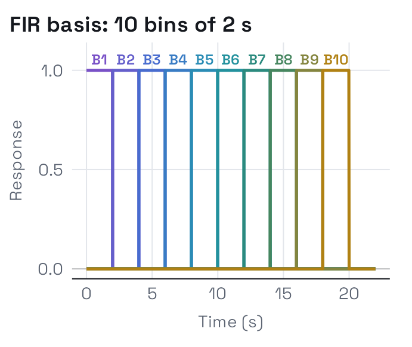
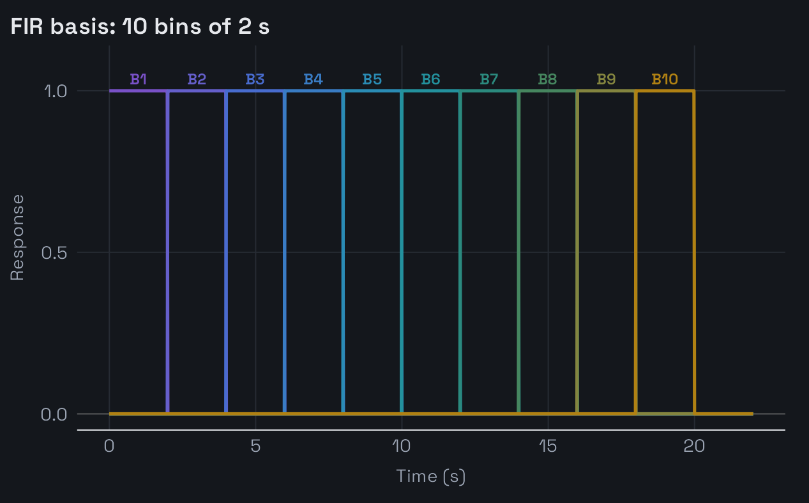
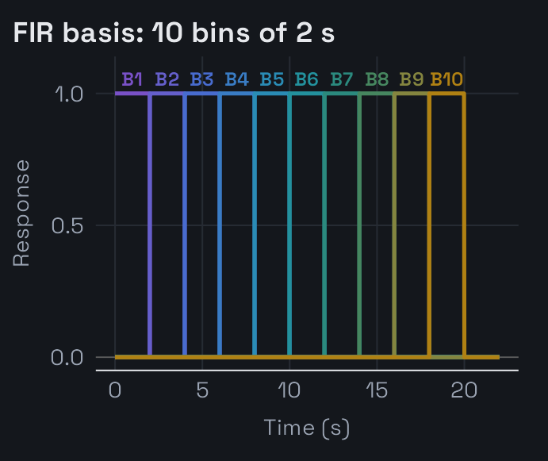

# HRF Generators

## Why Generators?

Most pre-defined HRFs in `fmrihrf` (like `HRF_SPMG1` or `HRF_GAUSSIAN`)
are ready-to-use objects. However, some HRFs are actually *generators*.
A generator is a function that creates a new HRF object when you call
it. This allows you to specify the number of basis functions (`nbasis`)
and the time span (`span`) at creation time.

The library provides generators for flexible basis sets such as
B-splines and finite impulse response (FIR) models. They are available
through the internal `HRF_REGISTRY` and are also returned by
[`list_available_hrfs()`](https://bbuchsbaum.github.io/fmrihrf/reference/list_available_hrfs.md)
with type “generator”.

``` r

list_available_hrfs(details = TRUE) %>%
  dplyr::filter(type == "generator")
#>       name      type nbasis_default is_alias                description
#> 1  bspline generator              5    FALSE   bspline HRF (generator) 
#> 2     tent generator              5    FALSE      tent HRF (generator) 
#> 3  fourier generator              5    FALSE   fourier HRF (generator) 
#> 4 daguerre generator              3    FALSE  daguerre HRF (generator) 
#> 5      fir generator             12    FALSE       fir HRF (generator) 
#> 6      lwu generator       variable    FALSE       lwu HRF (generator) 
#> 7       bs generator              5     TRUE bs HRF (generator) (alias)
```

## Creating a Basis with a Generator

To obtain an actual HRF object from a generator, simply call the
generator function with your desired parameters. For example, to create
a B-spline basis with 8 functions spanning 32 seconds:

``` r

# Create a B-spline basis using gen_hrf
bs8 <- gen_hrf(hrf_bspline, N = 8, span = 32)
print(bs8)
#> -- HRF: hrf_bspline --------------------------------------- 
#>    Basis functions: 8 
#>    Span: 32 s
```

The returned value is a standard `HRF` object, so you can evaluate it or
use it in model formulas like any other HRF.

``` r

times <- seq(0, 32, by = 0.5)
mat <- bs8(times)
head(mat)
#>              2          3           4 5 6 7 8 9
#> [1,] 0.0000000 0.00000000 0.000000000 0 0 0 0 0
#> [2,] 0.3472245 0.02905801 0.000516915 0 0 0 0 0
#> [3,] 0.5356084 0.10485991 0.004135320 0 0 0 0 0
#> [4,] 0.5977173 0.21034749 0.013956706 0 0 0 0 0
#> [5,] 0.5661169 0.32846258 0.033082562 0 0 0 0 0
#> [6,] 0.4733728 0.44214696 0.064614378 0 0 0 0 0
```

## Visualising FIR Basis Functions

A finite impulse response (FIR) basis makes no assumption about the
shape of the response: each basis function is a boxcar covering one time
bin after the event, and the fitted weights trace out the response bin
by bin. Here we create a basis with 10 bins over a 20-second window;
each bin is a 2-second boxcar, labelled at its top:

``` r

fir10 <- hrf_fir_generator(nbasis = 10, span = 20)
print(fir10)
#> -- HRF: fir ----------------------------------------------- 
#>    Basis functions: 10 
#>    Span: 20 s
#>    Parameters: nbasis = 10, span = 20, bin_width = 2

plot_hrfs(fir10, time = seq(0, 22, by = 0.02),
          title = "FIR basis: 10 bins of 2 s")
```







## Summary

Generator functions are simple factories that let you customise flexible
HRF bases. They return normal `HRF` objects, which means you can
evaluate them, combine them with decorators, or insert them into
regressors just like the built-in HRFs. \`\`\`\`
