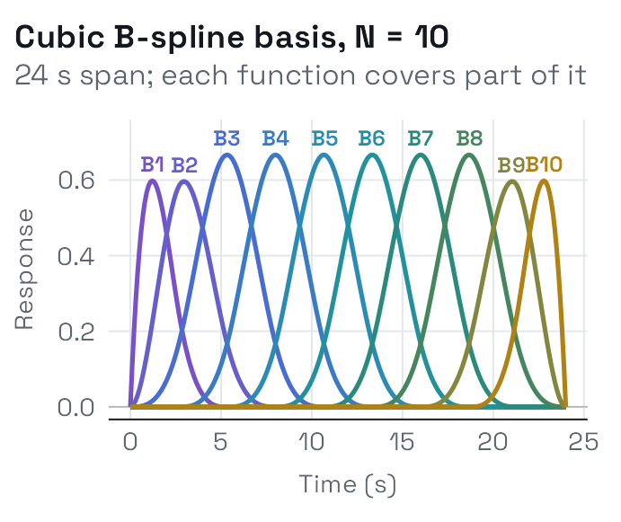
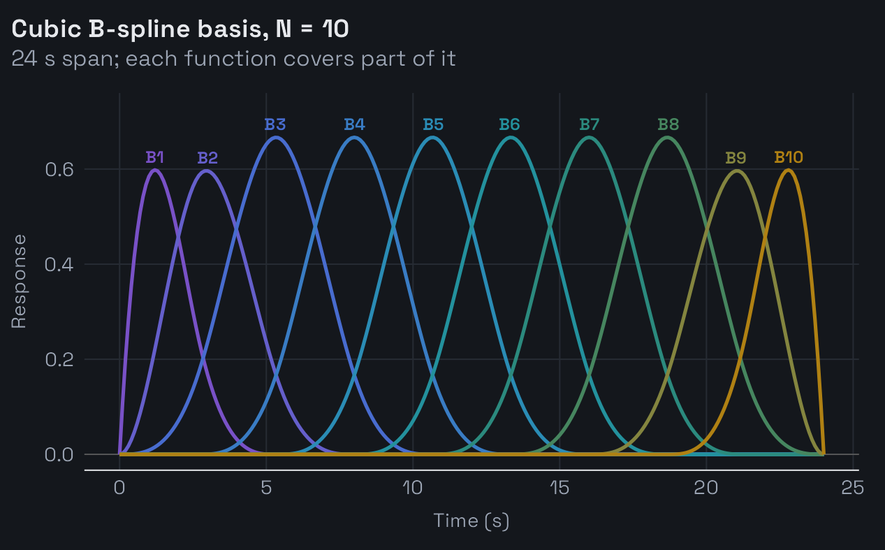
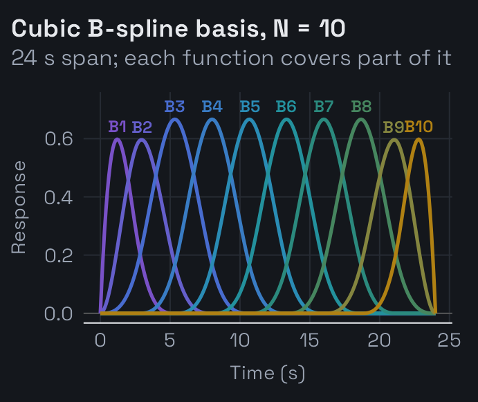
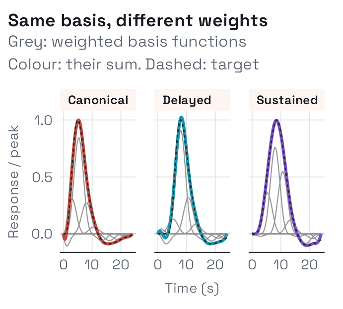
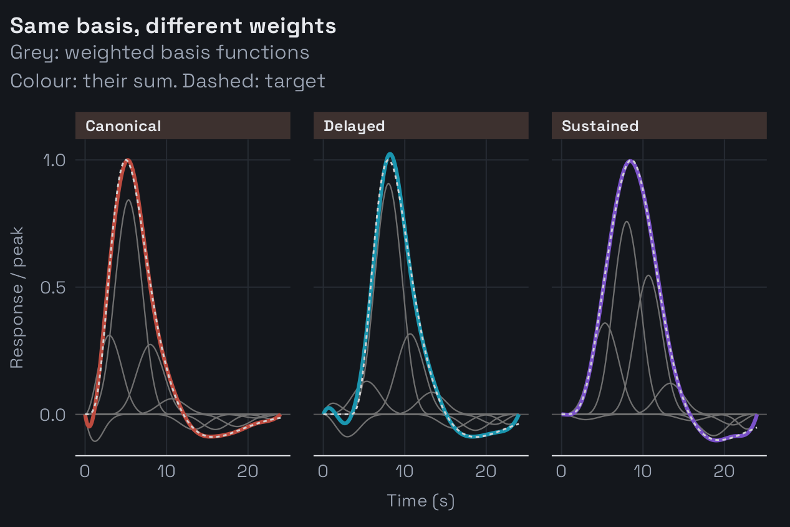
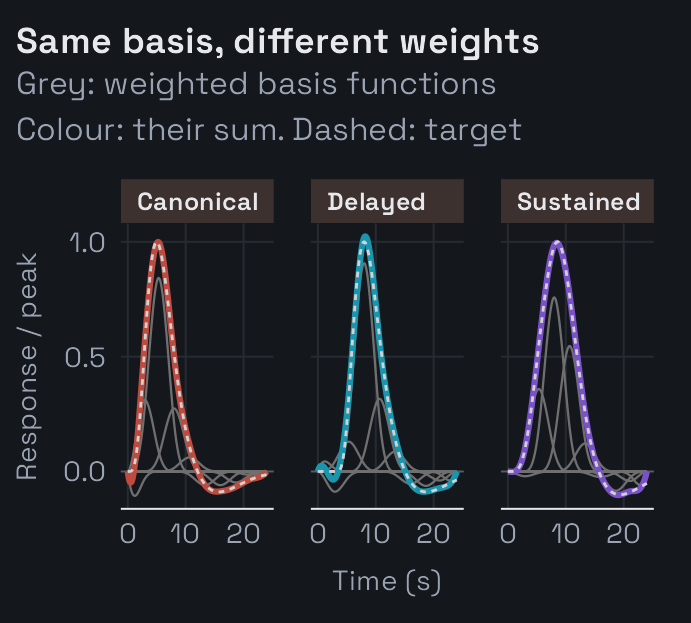
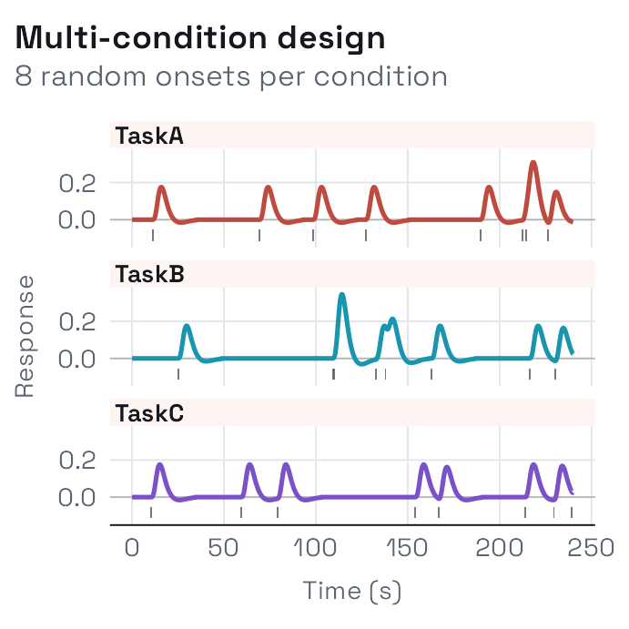
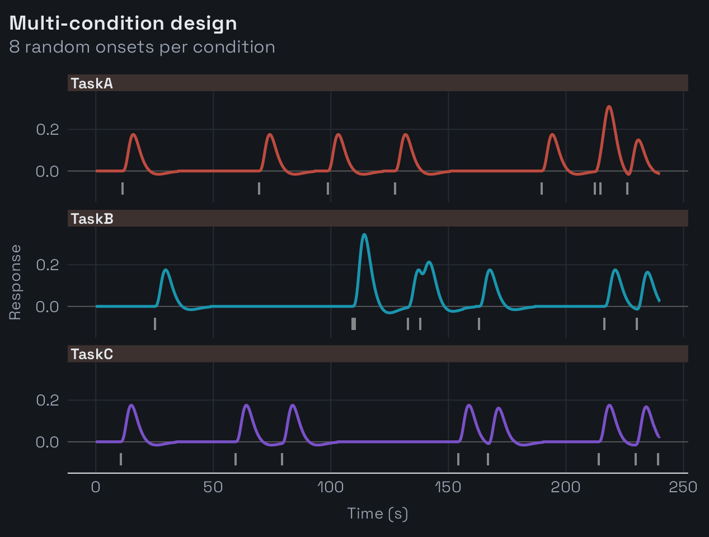
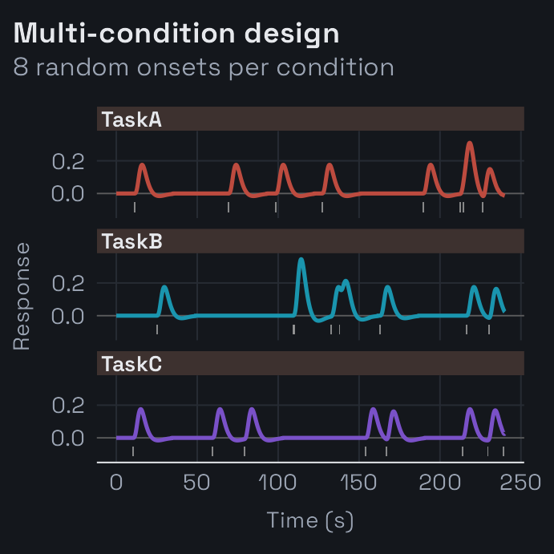

# Advanced HRF Modeling and Design

## Introduction

This vignette explores advanced features of `fmrihrf` for systematic HRF
modeling, regularization, and experimental design. We’ll cover four key
functions that extend the basic HRF framework:

- **[`hrf_library()`](https://bbuchsbaum.github.io/fmrihrf/reference/hrf_library.md)**:
  Creating systematic collections of HRF variants
- **[`reconstruction_matrix()`](https://bbuchsbaum.github.io/fmrihrf/reference/reconstruction_matrix.md)**:
  Converting basis coefficients back to HRF shapes
- **[`regressor_set()`](https://bbuchsbaum.github.io/fmrihrf/reference/regressor_set.md)**:
  Managing multi-condition experimental designs
- **[`regressor_design()`](https://bbuchsbaum.github.io/fmrihrf/reference/regressor_design.md)**:
  Building design matrices for complex experimental blocks

These tools are essential for advanced fMRI modeling where you need
flexibility in HRF specification, robust estimation with limited data,
or complex experimental designs.

## HRF Libraries: Systematic Parameter Exploration

The
[`hrf_library()`](https://bbuchsbaum.github.io/fmrihrf/reference/hrf_library.md)
function creates collections of HRF variants by systematically varying
parameters. This is useful for exploring how different HRF assumptions
affect your model or for building data-driven HRF basis sets.

### Example 1: Library of Gamma HRFs

Let’s create a library of gamma HRFs with different shape and rate
parameters:

``` r

# Define parameter grid for gamma HRFs
gamma_params <- expand.grid(
  shape = c(4, 6, 8),
  rate = c(0.8, 1.0, 1.2)
)
print(gamma_params)
#>   shape rate
#> 1     4  0.8
#> 2     6  0.8
#> 3     8  0.8
#> 4     4  1.0
#> 5     6  1.0
#> 6     8  1.0
#> 7     4  1.2
#> 8     6  1.2
#> 9     8  1.2

# Create a generator function for gamma HRFs
make_gamma_hrf <- function(shape, rate) {
  gen_hrf(hrf_gamma, shape = shape, rate = rate, name = paste0("Gamma_", shape, "_", rate))
}

# Create HRF library
gamma_lib <- hrf_library(make_gamma_hrf, gamma_params)
print(gamma_lib)
#> -- HRF: Gamma_4_0.8 + Gamma_6_0.8 + Gamma_8_0.8 + Gamma_4_1 + Gamma_6_1 + Gamma_8_1 + Gamma_4_1.2 + Gamma_6_1.2 + Gamma_8_1.2 - 
#>    Basis functions: 9 
#>    Span: 24 s
nbasis(gamma_lib) # 9 HRFs total (3 x 3 grid)
#> [1] 9

# Evaluate and visualize
time_points <- seq(0, 20, by = 0.1)
gamma_responses <- gamma_lib(time_points)

# Convert to long format for plotting
gamma_df <- as.data.frame(gamma_responses)
names(gamma_df) <- with(gamma_params, paste(shape, rate, sep = " / "))
gamma_df$Time <- time_points

gamma_long <- pivot_longer(gamma_df, -Time, names_to = "Parameters", values_to = "Response")
gamma_long <- gamma_long %>%
  separate(Parameters, into = c("Shape", "Rate"), sep = " / ", remove = FALSE) %>%
  mutate(Shape = factor(Shape, levels = c("4", "6", "8")),
         Rate = factor(Rate, levels = c("0.8", "1", "1.2")))

# One panel per shape; rate (an ordered parameter) uses the ordered palette
ggplot(gamma_long, aes(x = Time, y = Response, color = Rate)) +
  geom_hline(yintercept = 0, colour = "grey70", linewidth = 0.3) +
  geom_line(linewidth = 0.9) +
  facet_wrap(~Shape, ncol = 1, labeller = label_both) +
  scale_colour_hrf("ordered") +
  scale_y_continuous(breaks = c(0, 0.2)) +
  labs(title = "Gamma HRF library", subtitle = "Peak time = (shape - 1) / rate",
       x = "Time (s)", y = "Response", color = "Rate") +
  theme(legend.position = "bottom", legend.justification = "left",
        strip.text = element_text(hjust = 0), plot.title.position = "plot")
```


### Example 2: Library of Lagged SPM HRFs

Here’s how to create a library of the SPM canonical HRF with different
temporal lags:

``` r

# Parameter grid for temporal lags
lag_params <- data.frame(lag = seq(-2, 4, by = 1))
print(lag_params)
#>   lag
#> 1  -2
#> 2  -1
#> 3   0
#> 4   1
#> 5   2
#> 6   3
#> 7   4

# Create library using a helper function that applies lag_hrf
create_lagged_spm <- function(lag) {
  lag_hrf(HRF_SPMG1, lag = lag)
}

spm_lag_lib <- hrf_library(create_lagged_spm, lag_params)
print(spm_lag_lib)
#> -- HRF: SPMG1_lag(-2) + SPMG1_lag(-1) + SPMG1_lag(0) + SPMG1_lag(1) + SPMG1_lag(2) + SPMG1_lag(3) + SPMG1_lag(4) - 
#>    Basis functions: 7 
#>    Span: 28 s

# The library is a basis set: one column per lag
plot_hrfs(spm_lag_lib, time = time_points,
          labels = sprintf("%+d s", lag_params$lag), palette = "ordered",
          title = "Library of lagged SPM canonical HRFs",
          subtitle = "Lags from -2 to +4 s")
```


## Reconstruction Matrices: From Coefficients to HRF Shapes

The reconstruction process converts a set of basis coefficients into a
continuous HRF shape. Understanding this transformation is key to
interpreting estimated HRFs from fMRI analyses.

### How Reconstruction Works

A flexible basis set describes an HRF by a vector of weights, one per
basis function. The reconstruction matrix holds the basis functions
evaluated on a time grid (one column per function), so multiplying it by
the weights gives the HRF on that grid.

``` r

# Ten cubic B-splines with 24-second support
basis_set <- hrf_bspline_generator(nbasis = 10, span = 24)
eval_times <- seq(0, 24, by = 0.1)

# The reconstruction matrix: each column is a basis function evaluated at time points
recon_matrix <- reconstruction_matrix(basis_set, eval_times)
dim(recon_matrix)
#> [1] 241  10
```

Every function is zero at 0 s and at 24 s, so any weighted sum starts
and ends at baseline.

``` r

plot_hrfs(basis_set, time = eval_times,
          title = "Cubic B-spline basis, N = 10",
          subtitle = "24 s span; each function covers part of it")
```







In an analysis the weights come from the GLM. Here we obtain them by
least-squares fits of three target responses: the SPM canonical HRF, the
same response delayed by 3 s, and the response to a sustained 6-second
event. The basis is the same each time; only the weights change.

``` r

targets <- list(
  "Canonical" = HRF_SPMG1,
  "Delayed" = lag_hrf(HRF_SPMG1, 3),      # canonical, 3 s later
  "Sustained" = block_hrf(HRF_SPMG1, width = 6, normalize = TRUE)  # 6 s event
)
fits <- lapply(targets, function(h) {
  y <- h(eval_times)
  y <- y / max(y)                       # unit peak
  w <- qr.solve(recon_matrix, y)        # least-squares weights
  list(weights = w, fitted = drop(recon_matrix %*% w), target = y)
})

# Fit quality (R^2) for each target
sapply(fits, function(f) {
  1 - sum((f$target - f$fitted)^2) / sum((f$target - mean(f$target))^2)
})
#> Canonical   Delayed Sustained 
#> 0.9980561 0.9964472 0.9996352

canonical_coefs <- fits[["Canonical"]]$weights
round(canonical_coefs, 2)
#>  [1] -0.18  0.52  1.26  0.41  0.09 -0.09 -0.09 -0.07 -0.02 -0.03
```

### Building an HRF from Weighted Basis Functions

Each panel shows the weighted basis functions (thin grey lines), their
sum, the reconstructed HRF (thick coloured line), and the target it was
fitted to (dashed). The canonical response is carried mainly by B3, with
help from B2 and B4; its undershoot comes from the small negative
weights on B6–B8. The fits are not perfect: the small dip in the first
second of the canonical fit, and the wiggle before the delayed rise, are
fitting errors, not modelled features. Because every basis function is
zero at 24 s, the fits also return to zero there even where a target is
still slightly below baseline (most visibly the sustained response’s
undershoot).

``` r

component_df <- do.call(rbind, lapply(names(fits), function(nm) {
  w <- fits[[nm]]$weights
  data.frame(
    Time = rep(eval_times, length(w)),
    Value = as.vector(sweep(recon_matrix, 2, w, `*`)),
    Basis = factor(rep(paste0("B", seq_along(w)), each = length(eval_times)),
                   levels = paste0("B", seq_along(w))),
    Target = nm
  )
}))
sum_df <- do.call(rbind, lapply(names(fits), function(nm) {
  data.frame(Time = eval_times, Value = fits[[nm]]$fitted,
             Target_value = fits[[nm]]$target, Target = nm)
}))
component_df$Target <- factor(component_df$Target, levels = names(fits))
sum_df$Target <- factor(sum_df$Target, levels = names(fits))

ggplot(component_df, aes(Time, Value)) +
  geom_hline(yintercept = 0, colour = "grey70", linewidth = 0.3) +
  geom_line(aes(group = Basis), colour = "grey60", linewidth = 0.4) +
  geom_line(data = sum_df, aes(colour = Target), linewidth = 1.1) +
  geom_line(data = sum_df, aes(y = Target_value), colour = "grey15",
            linewidth = 0.5, linetype = "22") +
  facet_wrap(~Target, nrow = 1) +
  scale_colour_hrf() +
  scale_x_continuous(breaks = c(0, 10, 20)) +
  scale_y_continuous(breaks = c(0, 0.5, 1)) +
  labs(title = "Same basis, different weights",
       subtitle = "Grey: weighted basis functions\nColour: their sum. Dashed: target",
       x = "Time (s)", y = "Response / peak") +
  theme(legend.position = "none", strip.text = element_text(hjust = 0),
        plot.title.position = "plot")
```







The weights themselves summarize the shape. For the delayed response the
largest weight moves from B3 to B4 (and B2 turns slightly negative to
delay the rise); a sustained event spreads it over B3 to B5:

``` r

coef_df <- do.call(rbind, lapply(names(fits), function(nm) {
  w <- fits[[nm]]$weights
  data.frame(Basis = factor(paste0("B", seq_along(w)), levels = paste0("B", seq_along(w))),
             Weight = w, Target = nm)
}))
coef_df$Target <- factor(coef_df$Target, levels = names(fits))

coef_df$Index <- as.integer(coef_df$Basis)
ggplot(coef_df, aes(Index, Weight, colour = Target)) +
  geom_hline(yintercept = 0, colour = "grey70", linewidth = 0.3) +
  geom_segment(aes(xend = Index, y = 0, yend = Weight), linewidth = 0.9) +
  geom_point(size = 2.2) +
  facet_wrap(~Target, ncol = 1) +
  scale_colour_hrf() +
  scale_x_continuous(breaks = 1:10, minor_breaks = NULL) +
  scale_y_continuous(breaks = c(0, 1)) +
  labs(title = "Basis weights for each target", x = "Basis function (B1-B10)",
       y = "Weight") +
  theme(legend.position = "none", strip.text = element_text(hjust = 0),
        plot.title.position = "plot")
```


## Regressor Sets: Multi-Condition Experimental Designs

The
[`regressor_set()`](https://bbuchsbaum.github.io/fmrihrf/reference/regressor_set.md)
function simplifies creating regressors for multi-condition experiments
where each condition shares the same HRF but has different event
timings.

``` r

# Simulate a 3-condition experiment
set.seed(123)
n_events_per_condition <- 8
total_duration <- 240  # 4 minutes

# Generate random onsets for each condition
condition_A_onsets <- sort(runif(n_events_per_condition, 0, total_duration))
condition_B_onsets <- sort(runif(n_events_per_condition, 0, total_duration))
condition_C_onsets <- sort(runif(n_events_per_condition, 0, total_duration))

# Combine all onsets and create factor
all_onsets <- c(condition_A_onsets, condition_B_onsets, condition_C_onsets)
conditions <- factor(rep(c("TaskA", "TaskB", "TaskC"), each = n_events_per_condition))

# Create regressor set
reg_set <- regressor_set(onsets = all_onsets, fac = conditions, hrf = HRF_SPMG1)
print(reg_set)
#> $regs
#> $regs[[1]]
#> 
#> $regs[[2]]
#> 
#> $regs[[3]]
#> 
#> 
#> $levels
#> [1] "TaskA" "TaskB" "TaskC"
#> 
#> attr(,"class")
#> [1] "RegSet" "list"

# Evaluate at scan times (TR = 2s)
TR <- 2
scan_times <- seq(0, total_duration, by = TR)
design_matrix <- evaluate(reg_set, scan_times)

print(dim(design_matrix)) # Time points x 3 conditions
#> [1] 121   3
```

[`plot_regressors()`](https://bbuchsbaum.github.io/fmrihrf/reference/plot_regressors.md)
accepts a regressor set directly. With `layout = "stack"`, each
condition gets its own panel and its own events are marked below its
curve. `scales = "fixed"` puts all panels on one y axis, so response
sizes can be compared across conditions:

``` r

plot_regressors(reg_set, grid = seq(0, total_duration, by = 0.1),
                layout = "stack", scales = "fixed",
                title = "Multi-condition design",
                subtitle = "8 random onsets per condition")
```







## Regressor Design: Complex Block Designs

For more complex experimental designs with multiple blocks or runs,
[`regressor_design()`](https://bbuchsbaum.github.io/fmrihrf/reference/regressor_design.md)
provides a higher-level interface that handles block-relative timing and
creates design matrices directly.

``` r

# Create a sampling frame for 2 blocks of 120 scans (240 s) each
sframe <- sampling_frame(
  blocklens = c(120, 120),  # Two 4-minute blocks (120 scans each at TR = 2s)
  TR = 2                    # 2-second TR
)
print(sframe)
#> Sampling Frame
#> ==============
#> 
#> Structure:
#>   2 blocks
#>   Total scans: 240
#> 
#> Timing:
#>   TR: 2 s
#>   Precision: 0.1 s
#> 
#> Duration:
#>   Total time: 480.0 s

# Generate block-relative event onsets
# Block 1: Faces at 10, 50, 90; Houses at 30, 70 seconds
# Block 2: Faces at 15, 55, 95; Houses at 35, 75 seconds  
block_onsets <- c(10, 30, 50, 70, 90, 15, 35, 55, 75, 95)
block_ids <- c(rep(1, 5), rep(2, 5))
event_conditions <- factor(c("Faces", "Houses", "Faces", "Houses", "Faces", 
                            "Faces", "Houses", "Faces", "Houses", "Faces"))

# Create design matrix using regressor_design
design_mat <- regressor_design(
  onsets = block_onsets,
  fac = event_conditions,
  block = block_ids,
  sframe = sframe,
  hrf = HRF_SPMG1
)

print(dim(design_mat)) # Total time points across both blocks x 2 conditions
#> [1] 240   2

# The same design on a 0.1 s grid shows the continuous responses; the design
# matrix itself is those responses sampled once per scan (TR = 2 s).
sframe_fine <- sampling_frame(blocklens = c(2400, 2400), TR = 0.1, precision = 0.05)
design_fine <- regressor_design(onsets = block_onsets, fac = event_conditions,
                                block = block_ids, sframe = sframe_fine, hrf = HRF_SPMG1)
fine_df <- data.frame(Time = rep(samples(sframe_fine, global = TRUE), 2),
                      Response = as.vector(design_fine),
                      Condition = rep(c("Faces", "Houses"), each = nrow(design_fine)))
scan_df <- data.frame(Time = rep(samples(sframe, global = TRUE), 2),
                      Response = as.vector(design_mat),
                      Condition = rep(c("Faces", "Houses"), each = nrow(design_mat)))
scan_df <- scan_df[abs(scan_df$Response) > 0.01, ]   # samples during responses
# Highest scan sample in each block, labelled on the Faces panel
peak_df <- do.call(rbind, lapply(split(scan_df[scan_df$Condition == "Faces", ],
                                       scan_df$Time[scan_df$Condition == "Faces"] > 240),
                                 function(d) d[which.max(d$Response), ]))

ggplot(fine_df, aes(Time, Response, colour = Condition)) +
  geom_hline(yintercept = 0, colour = "grey70", linewidth = 0.3) +
  geom_vline(xintercept = 240, colour = "grey45", linetype = "dashed") +
  geom_line(linewidth = 0.7) +
  geom_point(data = scan_df, size = 0.9) +
  geom_text(data = peak_df, aes(label = sprintf("max %.3f", Response)),
            hjust = -0.15, vjust = -0.4, size = 3, show.legend = FALSE) +
  facet_wrap(~Condition, ncol = 1) +
  scale_colour_hrf() +
  scale_y_continuous(breaks = c(0, 0.15), expand = expansion(mult = c(0.05, 0.35))) +
  labs(title = "Two-block design",
       subtitle = "Points: scan samples (TR = 2 s)\nDashed line: start of block 2",
       x = "Time (s)", y = "Predicted BOLD response") +
  theme(legend.position = "none", strip.text = element_text(hjust = 0),
        plot.title.position = "plot")
```


``` r


# Show global vs block-relative timing
timing_df <- data.frame(
  Block = block_ids,
  Block_Relative_Onset = block_onsets,
  Global_Onset = global_onsets(sframe, block_onsets, block_ids),
  Condition = event_conditions
)

print(timing_df)
#>    Block Block_Relative_Onset Global_Onset Condition
#> 1      1                   10           10     Faces
#> 2      1                   30           30    Houses
#> 3      1                   50           50     Faces
#> 4      1                   70           70    Houses
#> 5      1                   90           90     Faces
#> 6      2                   15          255     Faces
#> 7      2                   35          275    Houses
#> 8      2                   55          295     Faces
#> 9      2                   75          315    Houses
#> 10     2                   95          335     Faces
```

The curves are the same in both blocks, but the scan samples (points)
are not. Scans are taken at odd seconds (the middle of each 2-second
TR). Block 1’s events (10, 30, … s) peak 5 s later, at odd seconds, so a
scan lands on each peak (0.175). Block 2 starts at 240 s, so its events
fall at 255, 275, … s and peak at even seconds, between two scans; the
highest sampled value is 0.160. This is a property of the design matrix
sampled at TR = 2 s, not a difference between blocks; it is one reason
to jitter onsets relative to the scan grid.
