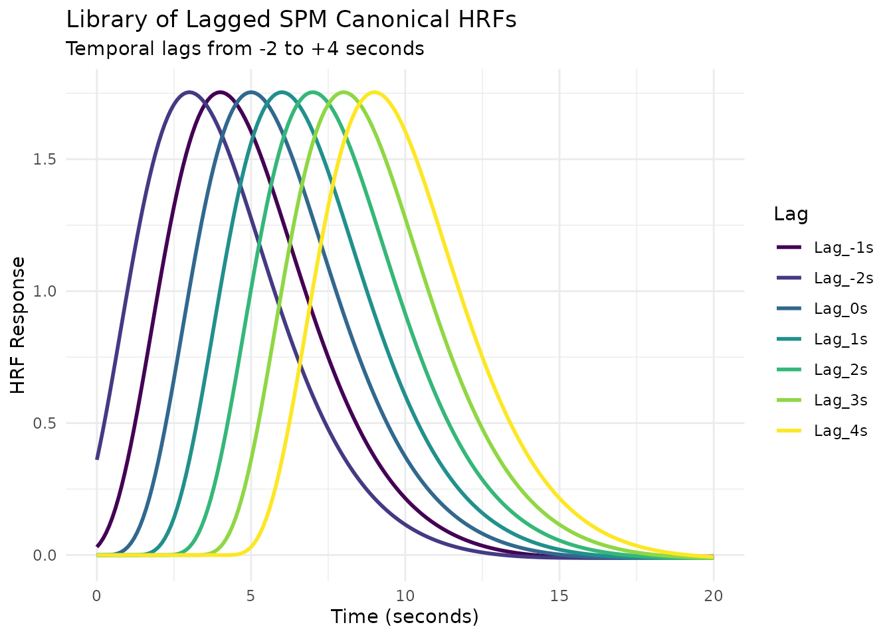
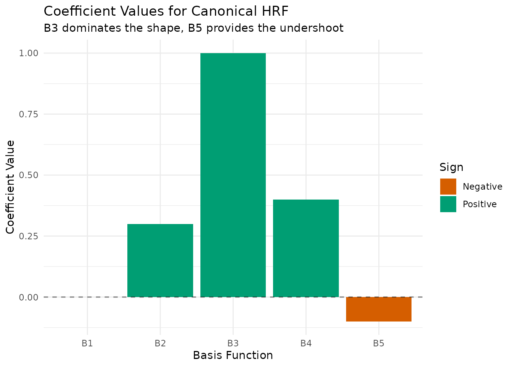
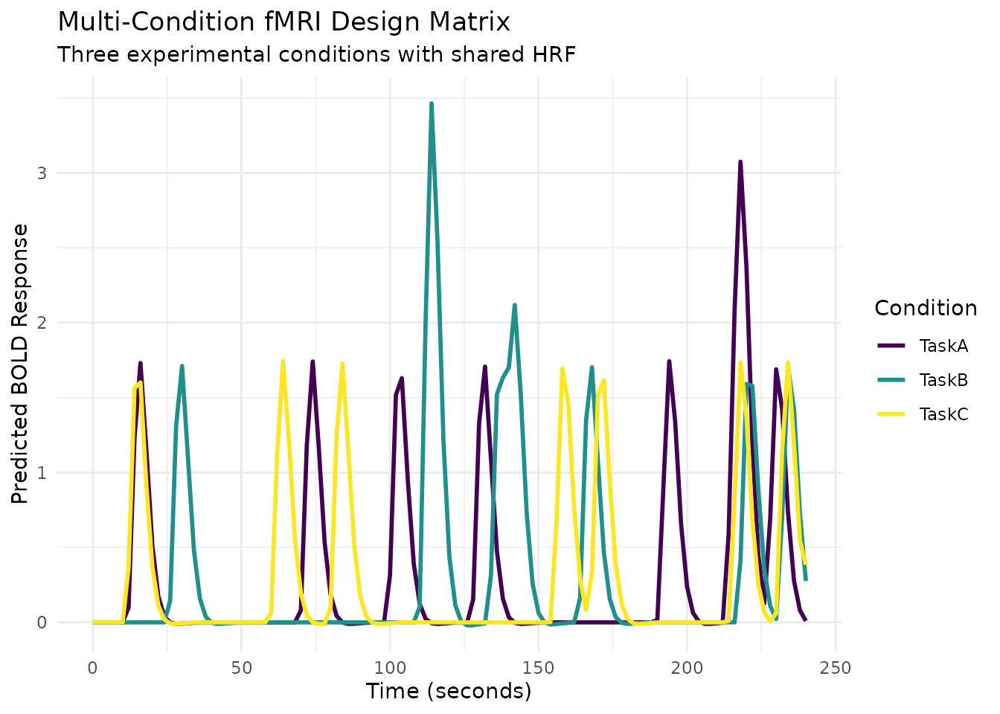
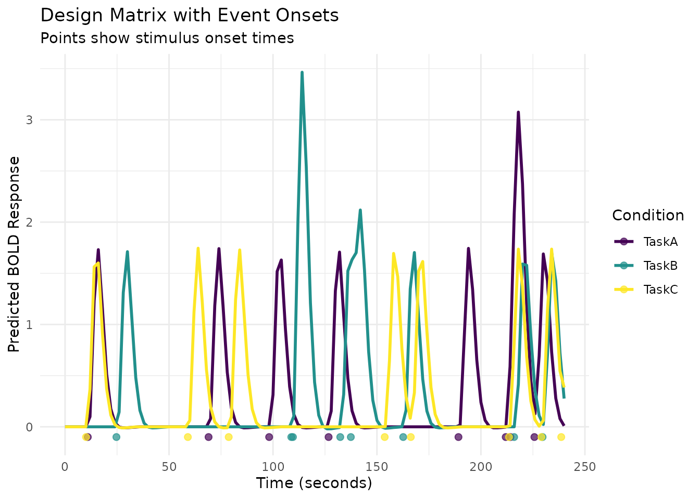

# Advanced HRF Modeling and Design

## Introduction

This vignette explores advanced features of `fmrihrf` for systematic HRF
modeling, regularization, and experimental design. We’ll cover five key
functions that extend the basic HRF framework:

- **[`hrf_library()`](https://bbuchsbaum.github.io/fmrihrf/reference/hrf_library.md)**:
  Creating systematic collections of HRF variants
- **[`reconstruction_matrix()`](https://bbuchsbaum.github.io/fmrihrf/reference/reconstruction_matrix.md)**:
  Converting basis coefficients back to HRF shapes
- **[`regressor_set()`](https://bbuchsbaum.github.io/fmrihrf/reference/regressor_set.md)**:
  Managing multi-condition experimental designs
- **[`regressor_design()`](https://bbuchsbaum.github.io/fmrihrf/reference/regressor_design.md)**:
  Building design matrices for complex experimental blocks

These tools are essential for advanced fMRI modeling where you need
flexibility in HRF specification, robust estimation with limited data,
or complex experimental designs.

## HRF Libraries: Systematic Parameter Exploration

The
[`hrf_library()`](https://bbuchsbaum.github.io/fmrihrf/reference/hrf_library.md)
function creates collections of HRF variants by systematically varying
parameters. This is useful for exploring how different HRF assumptions
affect your model or for building data-driven HRF basis sets.

### Example 1: Library of Gamma HRFs

Let’s create a library of gamma HRFs with different shape and rate
parameters:

``` r
# Define parameter grid for gamma HRFs
gamma_params <- expand.grid(
  shape = c(4, 6, 8),
  rate = c(0.8, 1.0, 1.2)
)
print(gamma_params)
#>   shape rate
#> 1     4  0.8
#> 2     6  0.8
#> 3     8  0.8
#> 4     4  1.0
#> 5     6  1.0
#> 6     8  1.0
#> 7     4  1.2
#> 8     6  1.2
#> 9     8  1.2

# Create a generator function for gamma HRFs
make_gamma_hrf <- function(shape, rate) {
  gen_hrf(hrf_gamma, shape = shape, rate = rate, name = paste0("Gamma_", shape, "_", rate))
}

# Create HRF library
gamma_lib <- hrf_library(make_gamma_hrf, gamma_params)
print(gamma_lib)
#> function (t) 
#> {
#>     do.call(cbind, lapply(xs, function(f) f(t)))
#> }
#> <bytecode: 0x55dd2cca91f8>
#> <environment: 0x55dd2cca67b0>
#> attr(,"class")
#> [1] "HRF"      "function"
#> attr(,"name")
#> [1] "Gamma_4_0.8 + Gamma_6_0.8 + Gamma_8_0.8 + Gamma_4_1 + Gamma_6_1 + Gamma_8_1 + Gamma_4_1.2 + Gamma_6_1.2 + Gamma_8_1.2"
#> attr(,"nbasis")
#> [1] 9
#> attr(,"span")
#> [1] 24
#> attr(,"params")
#> list()
nbasis(gamma_lib) # 9 HRFs total (3 x 3 grid)
#> [1] 9

# Evaluate and visualize
time_points <- seq(0, 20, by = 0.1)
gamma_responses <- gamma_lib(time_points)

# Convert to long format for plotting
gamma_df <- as.data.frame(gamma_responses)
names(gamma_df) <- paste0("Shape", gamma_params$shape, "_Rate", gamma_params$rate)
gamma_df$Time <- time_points

gamma_long <- pivot_longer(gamma_df, -Time, names_to = "Parameters", values_to = "Response")

# Create a more informative plot
ggplot(gamma_long, aes(x = Time, y = Response, color = Parameters)) +
  geom_line(linewidth = 1) +
  scale_color_viridis_d() +
  labs(title = "Library of Gamma HRFs",
       subtitle = "Systematic variation of shape and rate parameters",
       x = "Time (seconds)",
       y = "HRF Response") +
  theme_minimal() +
  theme(legend.position = "right")
```


### Example 2: Library of Lagged SPM HRFs

Here’s how to create a library of the SPM canonical HRF with different
temporal lags:

``` r
# Parameter grid for temporal lags
lag_params <- data.frame(lag = seq(-2, 4, by = 1))
print(lag_params)
#>   lag
#> 1  -2
#> 2  -1
#> 3   0
#> 4   1
#> 5   2
#> 6   3
#> 7   4

# Create library using a helper function that applies lag_hrf
create_lagged_spm <- function(lag) {
  lag_hrf(HRF_SPMG1, lag = lag)
}

spm_lag_lib <- hrf_library(create_lagged_spm, lag_params)
print(spm_lag_lib)
#> function (t) 
#> {
#>     do.call(cbind, lapply(xs, function(f) f(t)))
#> }
#> <bytecode: 0x55dd2cca91f8>
#> <environment: 0x55dd361bd258>
#> attr(,"class")
#> [1] "HRF"      "function"
#> attr(,"name")
#> [1] "SPMG1_lag(-2) + SPMG1_lag(-1) + SPMG1_lag(0) + SPMG1_lag(1) + SPMG1_lag(2) + SPMG1_lag(3) + SPMG1_lag(4)"
#> attr(,"nbasis")
#> [1] 7
#> attr(,"span")
#> [1] 28
#> attr(,"params")
#> list()

# Evaluate and plot
spm_lag_responses <- spm_lag_lib(time_points)
spm_lag_df <- as.data.frame(spm_lag_responses)
names(spm_lag_df) <- paste0("Lag_", lag_params$lag, "s")
spm_lag_df$Time <- time_points

spm_lag_long <- pivot_longer(spm_lag_df, -Time, names_to = "Lag", values_to = "Response")

ggplot(spm_lag_long, aes(x = Time, y = Response, color = Lag)) +
  geom_line(linewidth = 1) +
  scale_color_viridis_d() +
  labs(title = "Library of Lagged SPM Canonical HRFs",
       subtitle = "Temporal lags from -2 to +4 seconds",
       x = "Time (seconds)",
       y = "HRF Response") +
  theme_minimal()
```



## Reconstruction Matrices: From Coefficients to HRF Shapes

The reconstruction process converts a set of basis coefficients into a
continuous HRF shape. Understanding this transformation is key to
interpreting estimated HRFs from fMRI analyses.

### How Reconstruction Works

``` r
# Use a small basis for clear visualization
basis_set <- gen_hrf(hrf_bspline, N = 5, degree = 3, span = 30)
eval_times <- seq(0, 30, by = 0.1)

# The reconstruction matrix: each column is a basis function evaluated at time points
recon_matrix <- basis_set(eval_times)
print(paste("Reconstruction matrix dimensions:", nrow(recon_matrix), "time points x", 
            ncol(recon_matrix), "basis functions"))
#> [1] "Reconstruction matrix dimensions: 301 time points x 5 basis functions"

# Let's visualize the basis functions themselves first
basis_df <- as.data.frame(recon_matrix)
names(basis_df) <- paste0("B", 1:5)
basis_df$Time <- eval_times

basis_long <- pivot_longer(basis_df, -Time, names_to = "Basis", values_to = "Value")

ggplot(basis_long, aes(x = Time, y = Value, color = Basis)) +
  geom_line(linewidth = 1.2) +
  scale_color_viridis_d(option = "turbo") +
  labs(title = "B-spline Basis Functions",
       subtitle = "Each basis function covers a different time window",
       x = "Time (seconds)",
       y = "Basis Function Value") +
  theme_minimal()
```


``` r

# Now demonstrate reconstruction with different coefficient patterns
coefficient_sets <- list(
  "Early Peak" = c(0.2, 1.0, 0.3, 0.0, 0.0),
  "Canonical" = c(0.0, 0.3, 1.0, 0.4, -0.1),
  "Late Peak" = c(0.0, 0.0, 0.3, 1.0, 0.2),
  "Double Peak" = c(0.0, 0.8, 0.2, 0.9, 0.0)
)

# Reconstruct HRFs for each coefficient set
reconstruction_df <- data.frame()
for (name in names(coefficient_sets)) {
  coefs <- coefficient_sets[[name]]
  hrf_values <- as.vector(recon_matrix %*% coefs)
  
  df <- data.frame(
    Time = eval_times,
    HRF = hrf_values,
    Pattern = name
  )
  reconstruction_df <- rbind(reconstruction_df, df)
}

ggplot(reconstruction_df, aes(x = Time, y = HRF, color = Pattern)) +
  geom_line(linewidth = 1.5) +
  scale_color_manual(values = c("Early Peak" = "#E69F00", 
                               "Canonical" = "#009E73",
                               "Late Peak" = "#0072B2",
                               "Double Peak" = "#D55E00")) +
  labs(title = "Different HRF Shapes from Same Basis Set",
       subtitle = "Varying coefficients produces diverse HRF patterns",
       x = "Time (seconds)",
       y = "HRF Response") +
  theme_minimal() +
  theme(legend.position = "bottom")
```


### Interactive Visualization: Building an HRF Step by Step

``` r
# Let's build up a canonical HRF step by step
canonical_coefs <- c(0.0, 0.3, 1.0, 0.4, -0.1)

# Create data for cumulative reconstruction
cumulative_df <- data.frame()
for (i in 1:5) {
  # Zero out coefficients after position i
  temp_coefs <- canonical_coefs
  if (i < 5) temp_coefs[(i+1):5] <- 0
  
  # Calculate cumulative HRF
  cumulative_hrf <- as.vector(recon_matrix %*% temp_coefs)
  
  # Store individual contribution
  individual_coefs <- rep(0, 5)
  individual_coefs[i] <- canonical_coefs[i]
  individual_contribution <- as.vector(recon_matrix %*% individual_coefs)
  
  df <- data.frame(
    Time = rep(eval_times, 2),
    Value = c(cumulative_hrf, individual_contribution),
    Type = rep(c("Cumulative", "Individual"), each = length(eval_times)),
    Step = i,
    Basis = paste0("Adding B", i, " (coef=", round(canonical_coefs[i], 2), ")")
  )
  cumulative_df <- rbind(cumulative_df, df)
}

# Create faceted plot showing the build-up
ggplot(cumulative_df, aes(x = Time, y = Value, color = Type)) +
  geom_line(linewidth = 1.2) +
  facet_wrap(~Basis, ncol = 5) +
  scale_color_manual(values = c("Cumulative" = "black", "Individual" = "red")) +
  labs(title = "Building an HRF: Sequential Addition of Weighted Basis Functions",
       subtitle = "Red: individual contribution, Black: cumulative sum",
       x = "Time (seconds)",
       y = "Value") +
  theme_minimal() +
  theme(legend.position = "bottom",
        strip.text = element_text(size = 9))
```


``` r

# Show coefficient importance
coef_importance <- data.frame(
  Basis = paste0("B", 1:5),
  Coefficient = canonical_coefs,
  `Absolute Value` = abs(canonical_coefs)
)

ggplot(coef_importance, aes(x = Basis, y = Coefficient, fill = Coefficient > 0)) +
  geom_col() +
  geom_hline(yintercept = 0, linetype = "dashed", alpha = 0.5) +
  scale_fill_manual(values = c("FALSE" = "#D55E00", "TRUE" = "#009E73"),
                    labels = c("Negative", "Positive")) +
  labs(title = "Coefficient Values for Canonical HRF",
       subtitle = "B3 dominates the shape, B5 provides the undershoot",
       x = "Basis Function",
       y = "Coefficient Value",
       fill = "Sign") +
  theme_minimal()
```



## Regressor Sets: Multi-Condition Experimental Designs

The
[`regressor_set()`](https://bbuchsbaum.github.io/fmrihrf/reference/regressor_set.md)
function simplifies creating regressors for multi-condition experiments
where each condition shares the same HRF but has different event
timings.

``` r
# Simulate a 3-condition experiment
set.seed(123)
n_events_per_condition <- 8
total_duration <- 240  # 4 minutes

# Generate random onsets for each condition
condition_A_onsets <- sort(runif(n_events_per_condition, 0, total_duration))
condition_B_onsets <- sort(runif(n_events_per_condition, 0, total_duration))
condition_C_onsets <- sort(runif(n_events_per_condition, 0, total_duration))

# Combine all onsets and create factor
all_onsets <- c(condition_A_onsets, condition_B_onsets, condition_C_onsets)
conditions <- factor(rep(c("TaskA", "TaskB", "TaskC"), each = n_events_per_condition))

# Create regressor set
reg_set <- regressor_set(onsets = all_onsets, fac = conditions, hrf = HRF_SPMG1)
print(reg_set)
#> $regs
#> $regs[[1]]
#> 
#> $regs[[2]]
#> 
#> $regs[[3]]
#> 
#> 
#> $levels
#> [1] "TaskA" "TaskB" "TaskC"
#> 
#> attr(,"class")
#> [1] "RegSet" "list"

# Evaluate at scan times (TR = 2s)
TR <- 2
scan_times <- seq(0, total_duration, by = TR)
design_matrix <- evaluate(reg_set, scan_times)

print(dim(design_matrix)) # Time points x 3 conditions
#> [1] 121   3

# Visualize the design matrix
design_df <- as.data.frame(design_matrix)
names(design_df) <- c("TaskA", "TaskB", "TaskC")
design_df$Time <- scan_times

design_long <- pivot_longer(design_df, -Time, names_to = "Condition", values_to = "Response")

ggplot(design_long, aes(x = Time, y = Response, color = Condition)) +
  geom_line(linewidth = 1) +
  scale_color_viridis_d() +
  labs(title = "Multi-Condition fMRI Design Matrix",
       subtitle = "Three experimental conditions with shared HRF",
       x = "Time (seconds)",
       y = "Predicted BOLD Response",
       color = "Condition") +
  theme_minimal()
```



``` r

# Add event markers
onset_df <- data.frame(
  Time = all_onsets,
  Condition = conditions,
  Marker = 1
)

ggplot(design_long, aes(x = Time, y = Response, color = Condition)) +
  geom_line(linewidth = 1) +
  geom_point(data = onset_df, aes(x = Time, y = -0.1, color = Condition), 
             size = 2, alpha = 0.7) +
  scale_color_viridis_d() +
  labs(title = "Design Matrix with Event Onsets",
       subtitle = "Points show stimulus onset times",
       x = "Time (seconds)",
       y = "Predicted BOLD Response",
       color = "Condition") +
  theme_minimal()
```



## Regressor Design: Complex Block Designs

For more complex experimental designs with multiple blocks or runs,
[`regressor_design()`](https://bbuchsbaum.github.io/fmrihrf/reference/regressor_design.md)
provides a higher-level interface that handles block-relative timing and
creates design matrices directly.

``` r
# Create a sampling frame for 2 blocks of 120 seconds each
sframe <- sampling_frame(
  blocklens = c(120, 120),  # Two 4-minute blocks (120 scans each at TR = 2s)
  TR = 2                    # 2-second TR
)
print(sframe)
#> Sampling Frame
#> ==============
#> 
#> Structure:
#>   2 blocks
#>   Total scans: 240
#> 
#> Timing:
#>   TR: 2 s
#>   Precision: 0.1 s
#> 
#> Duration:
#>   Total time: 480.0 s

# Generate block-relative event onsets
# Block 1: Faces at 10, 50, 90; Houses at 30, 70 seconds
# Block 2: Faces at 15, 55, 95; Houses at 35, 75 seconds  
block_onsets <- c(10, 30, 50, 70, 90, 15, 35, 55, 75, 95)
block_ids <- c(rep(1, 5), rep(2, 5))
event_conditions <- factor(c("Faces", "Houses", "Faces", "Houses", "Faces", 
                            "Faces", "Houses", "Faces", "Houses", "Faces"))

# Create design matrix using regressor_design
design_mat <- regressor_design(
  onsets = block_onsets,
  fac = event_conditions,
  block = block_ids,
  sframe = sframe,
  hrf = HRF_SPMG1
)

print(dim(design_mat)) # Total time points across both blocks x 2 conditions
#> [1] 240   2

# Convert to data frame for plotting
# Use global=TRUE to get continuous time across blocks
time_points <- samples(sframe, global = TRUE)
design_plot_df <- as.data.frame(design_mat)
names(design_plot_df) <- c("Faces", "Houses")
design_plot_df$Time <- time_points
design_plot_df$Block <- rep(1:2, each = 120) # 120 scans per block

design_plot_long <- pivot_longer(design_plot_df, c("Faces", "Houses"),
                                names_to = "Condition", values_to = "Response")

# Plot with block separation (block boundary at 240 seconds)
ggplot(design_plot_long, aes(x = Time, y = Response, color = Condition)) +
  geom_line(linewidth = 1) +
  geom_vline(xintercept = 240, linetype = "dashed", alpha = 0.7) +
  scale_color_viridis_d() +
  labs(title = "Multi-Block Experimental Design",
       subtitle = "Two blocks with different event schedules (dashed line = block boundary)",
       x = "Time (seconds)",
       y = "Predicted BOLD Response",
       color = "Condition") +
  theme_minimal()
```


``` r

# Show global vs block-relative timing
timing_df <- data.frame(
  Block = block_ids,
  Block_Relative_Onset = block_onsets,
  Global_Onset = global_onsets(sframe, block_onsets, block_ids),
  Condition = event_conditions
)

print(timing_df)
#>    Block Block_Relative_Onset Global_Onset Condition
#> 1      1                   10           10     Faces
#> 2      1                   30           30    Houses
#> 3      1                   50           50     Faces
#> 4      1                   70           70    Houses
#> 5      1                   90           90     Faces
#> 6      2                   15          255     Faces
#> 7      2                   35          275    Houses
#> 8      2                   55          295     Faces
#> 9      2                   75          315    Houses
#> 10     2                   95          335     Faces
```
